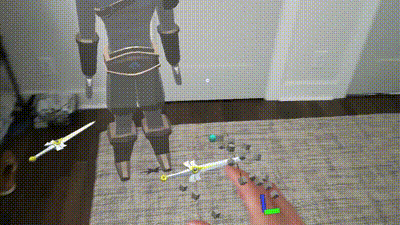
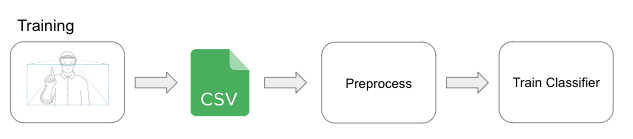
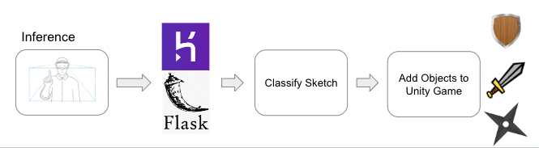

# XROG
## Extended Reality Object Generation

### Overview
XROG is a Unity-based project utilizing Microsoft's Mixed Reality Toolkit (MRTK) for hand tracking to create an interactive environment where users generate objects through gesture recognition. It integrates Unity, Python, and cloud services for real-time gesture classification and object generation.

### Training

#### Data Collection
Data is collected via Unity and MRTK, which tracks hand movements and pinching gestures. When a pinch gesture is detected, a red sphere indicates data collection, and the index finger's coordinates are recorded. Data is saved in CSV format, capturing frame numbers and positions. Samples are treated as sparse point clouds and assigned to object classes based on the gesture.

#### Preprocessing
Preprocessing steps include:
1. Resampling point clouds to a uniform size.
2. Centering and normalizing point clouds.
3. Applying data augmentations (translation, rotation, noise).

These steps ensure consistent input for the ML model and improve robustness by increasing data variety.

### Inference

#### Data Handling
Inference data is captured similarly to training data and sent to a cloud-hosted Python app for classification. Preprocessing aligns the data format with the training dataset.

#### Cloud ML
XROG uses Flask and Heroku to host the trained SVM model and perform remote classification. Unity sends data to the cloud app, which processes and classifies it, returning results to Unity.

#### Unity Scene
The Unity scene generates objects based on classified gestures. Objects (swords, stars, shields) are interactable and support MRTK's near and far interaction.

### Evaluation
### Sketch/Gesture Classification
While classification accuracy was not the main focus, an SVM model achieved around 89% accuracy on augmented data.

#### Unity Scene
The Unity scene successfully generated objects in real-time with no significant bugs, demonstrating accurate and intuitive performance.

For further demonstration, refer to the video in the project’s GitHub repository.

### Future
XROG provides an interactive, gesture-based environment for object generation in Unity, leveraging MRTK, cloud-based ML models, and extensive preprocessing techniques for robust gesture recognition. I hope to continue this project through the eventual integration of generative 3D models such as OpenAI's PointE. A system with interactive 3D object generation could have large impact in gaming, design, and more. 

### How to Run
1) Create your own data by copying the project into Unity and using the Pinch.cs (Assets &rarr Scripts &rarr Pinch.cs) to save out data or use the provided dataset in the data folder
2) Preprocess and train data using preprocesing_training.ipynb, save out model weights to ARSketch_ML
3) Host app.py on Heroku using Flask
4) Enter Unity environment and use PinchInference.cs to generate the included prefabs in your AR environment

Requires Unity and a MRTK compatible headset, this project was done using a Hololens2.

See report.pdf for more details.

Reach out to me with any questions.
